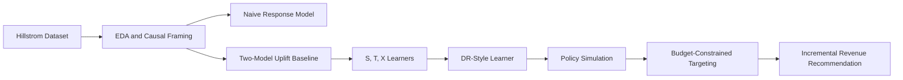

# uplift-modeling-causal-ml

[](https://www.python.org/)
[](#)
[](#)
[](#)

Causal ML and uplift modeling project for marketing campaign targeting under budget constraints.

Most campaign models answer:

> Who is likely to convert?

This project answers the decision question:

> Who is likely to convert because of the campaign?

The workflow ranks customers by predicted incremental effect and evaluates targeting policies by incremental conversions and simulated incremental revenue.

## Project overview
This project uses the Hillstrom Email Marketing dataset to build a complete uplift workflow from causal framing to policy recommendation.

Core objective:

> Which customers should receive an email campaign to maximize incremental conversions and incremental revenue, not just conversion propensity?

## Why this matters
Traditional response models often prioritize likely buyers who may have converted anyway. Uplift modeling is closer to campaign decision making because it targets expected incremental impact.

### Marketing intuition

| Customer type | What it means | Should we target? |
| --- | --- | --- |
| Persuadables | More likely to convert because of the email | Yes |
| Sure Things | Likely to convert with or without email | Usually no |
| Lost Causes | Unlikely to convert either way | No |
| Sleeping Dogs | Might convert less if contacted | Avoid |

## Business problem
This is a budgeted policy problem.

- marketing budget is limited
- customer attention is limited
- over-targeting can create fatigue
- the objective is incremental value

Primary optimization target:

- Primary outcome: `conversion`
- Secondary outcomes: `visit`, `spend`

## Dataset
Primary dataset: Kevin Hillstrom and MineThatData Email Marketing dataset.

- Canonical path: `data/hillstrom.csv`
- Approximate size: 64,000 customers

Original treatment setup is usually 3-arm:

- `No E-Mail`
- `Mens E-Mail`
- `Womens E-Mail`

Modeling simplification used in this repo:

- treated = any email (`Mens E-Mail` or `Womens E-Mail`)
- control = no email (`No E-Mail`)

This binary treatment setup is intentional and explicit.

## Causal framing
Potential outcomes perspective:

- `Y(1)` = outcome if treated
- `Y(0)` = outcome if untreated
- `tau(x) = E[Y(1) - Y(0) | X=x]`

Only one potential outcome is observed for each user. This is the core challenge of causal inference and why uplift modeling differs from standard prediction.

## Feature governance
To keep the setup causally valid:

- all model training uses pre-treatment covariates only
- outcomes and treatment-derived labels are excluded from features
- shared preprocessing and split logic are reused across notebooks

## Methods
### Classical uplift foundation

| Method | Intuition | Why included |
| --- | --- | --- |
| Naive treated-response model | Predict conversion in treated users only | Shows why response ranking is not enough |
| Two-model uplift baseline | Fit treated and control models separately and subtract | Strong practical baseline |
| S-Learner | One model with treatment as a feature | Compact baseline |
| T-Learner | Separate treatment and control outcome models | Often strong on tabular data |
| X-Learner | Two-stage effect modeling | Useful when arm behavior differs |

### Modern causal and policy layer

| Method or component | Purpose |
| --- | --- |
| DR-style learner | More robust CATE estimation via outcome plus propensity modeling |
| Optional orthogonal or forest validation | Modern causal challenger methods |
| Policy simulation | Translate scores into campaign actions |
| Budget sensitivity analysis | Measure value across targeting budgets |

### Advanced extension

| Method | Purpose |
| --- | --- |
| TARNet | Optional deep representation-learning uplift extension |

## Evaluation framework
Core ranking metrics:

- Uplift curve
- Qini coefficient
- AUUC
- Cumulative gain
- Uplift by decile

Policy-oriented metrics:

- Policy value at budget
- Incremental conversions at budget
- Incremental revenue at budget
- Budget sensitivity analysis

Important caveat:

Qini and AUUC are ranking metrics. They are not direct proof that every individual treatment effect is perfectly estimated.

## Project workflow


## Key visuals
### Treatment balance and causal setup
Update paths below if your filenames differ.

| Treatment balance | Outcome rates by group |
| --- | --- |
|  |  |

| Spend comparison | Standardized mean differences |
| --- | --- |
|  |  |

### Model comparison and policy impact

| Baseline uplift comparison | Meta-learner comparison |
| --- | --- |
|  |  |

| DR learner diagnostics | Budget sensitivity |
| --- | --- |
|  |  |

## Key results
### Current offline snapshot
Using a shared split strategy and `random_state = 42`:

- The two-model uplift baseline outperformed the naive treated-response model on Qini and AUUC.
- Among S, T, and X learners, the T-Learner performed best on the current split.
- In offline policy simulations, uplift-aware targeting policies outperformed naive and random targeting across multiple budget levels.
- A manual DR-style implementation did not beat the strongest classical uplift models on the current run.

### Model metric table

| Model | Qini | AUUC |
| --- | ---: | ---: |
| two_model_uplift | 3.926 | 25.378 |
| naive_response | 3.415 | 24.867 |
| x_learner | 1.584 | 23.036 |
| dr_learner (manual fallback) | -1.996 | 19.456 |

### Policy summary table

| Model | Best budget range | Incremental conversions @ top 20% | Incremental revenue @ top 20% | Recommendation |
| --- | ---: | ---: | ---: | --- |
| two_model_uplift | 0.9 | 21.06 | 2451.13 | Primary deployment candidate |
| t_learner | 0.9 | 21.06 | 2451.13 | Primary deployment candidate |
| naive_response | 0.8 | 21.33 | 2482.56 | Baseline only, not causal-targeting aligned |
| dr_manual_fallback | 0.9 | 9.02 | 1049.32 | Challenger, tune nuisance models |

### Interpretation
This result pattern is useful and realistic.

It suggests that:

- uplift-aware ranking improves campaign decisioning
- causal framing matters more than simple propensity ranking
- more complex estimators are not automatically better on medium-sized tabular marketing data
- model complexity should be judged by policy value, not method sophistication alone

## Deployment recommendation
Based on current offline evidence:

- Primary deployment candidate: two-model uplift or T-Learner
- Why: stronger and more stable ranking behavior on the current split with better downstream policy value than naive targeting
- Challenger model: DR-style learner after stronger nuisance tuning or official library validation
- Final validation requirement: online testing before production rollout

### Practical recommendation
A simpler uplift-aware model can be preferable when it offers:

- competitive policy performance
- easier debugging
- easier stakeholder explanation
- lower maintenance cost

## Offline policy assumptions used in Notebook 05
The revenue and policy sections are framed as offline simulation, not production proof.

Assumptions:

- model ranking is based on predicted uplift or CATE scores
- incremental conversions are estimated from observed treatment and control outcomes within ranked buckets
- incremental revenue is approximated using observed spend or average order value assumptions
- these are offline policy evaluation estimates, not causal proof of realized production revenue lift

## How to run
### Environment
- Python 3.10+
- On macOS, prefer native arm64 Python on Apple Silicon instead of Rosetta

### Install dependencies
```bash
pip install -r requirements.txt
```

### Start Jupyter
```bash
jupyter lab
```

or

```bash
jupyter notebook
```

### Execution order
Run notebooks in this order:

1. `01_eda_problem_framing.ipynb`
2. `02_naive_and_two_model_baselines.ipynb`
3. `03_meta_learners_s_t_x.ipynb`
4. `04_modern_causal_ml_dr_learner.ipynb`
5. `05_policy_evaluation_and_business_impact.ipynb`
6. `06_optional_tarnet_deep_uplift.ipynb`

### Execution defaults
- Global random seed: `42`
- Baseline learner preference: XGBoost CPU with `tree_method="hist"`
- LightGBM supported as an alternative
- Deep notebook uses Torch MPS when available, otherwise CPU fallback

## Reproducibility notes
- Shared split strategy is locked across Notebooks 02 to 05
- Random state is fixed to 42
- Binary treatment is derived as:

```python
treatment = (segment != "No E-Mail").astype(int)
```

- Modeling target defaults to conversion

## Limitations
This repo is practical, but has important limitations:

- offline uplift evaluation is not the same as online causal validation
- treatment is simplified from the original 3-arm design into a binary setup
- individual treatment effects are latent and noisy
- incremental revenue is estimated under offline assumptions
- model rankings may vary across splits and tuning choices
- deep causal models may require environment-specific runtime fixes

## Future work
- improve doubly robust estimation and nuisance tuning
- add DML and orthogonal or causal forest variants
- restore full multi-treatment setup
- explore direct policy learning
- add treatment effect calibration analysis
- study fairness and responsible targeting
- extend to dynamic uplift over time
- explore continuous treatment or dosage optimization

## Tech stack
- Python
- pandas
- numpy
- scikit-learn
- xgboost
- lightgbm
- pytorch
- matplotlib
- seaborn
- umap-learn
- jupyter

## Contact
If you are reviewing this repo for data science, causal inference, experimentation, or marketing analytics roles, you can connect through GitHub.

## License
Add your preferred license, for example MIT.
