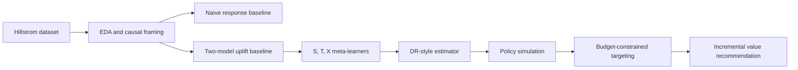
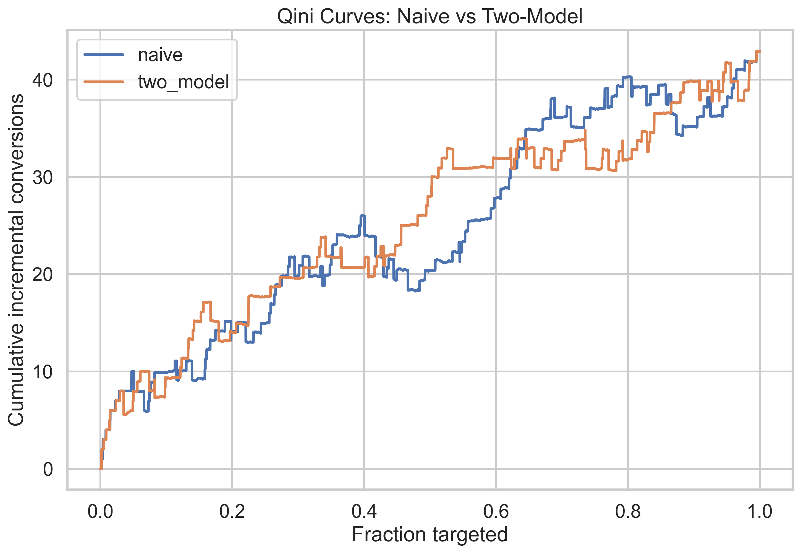
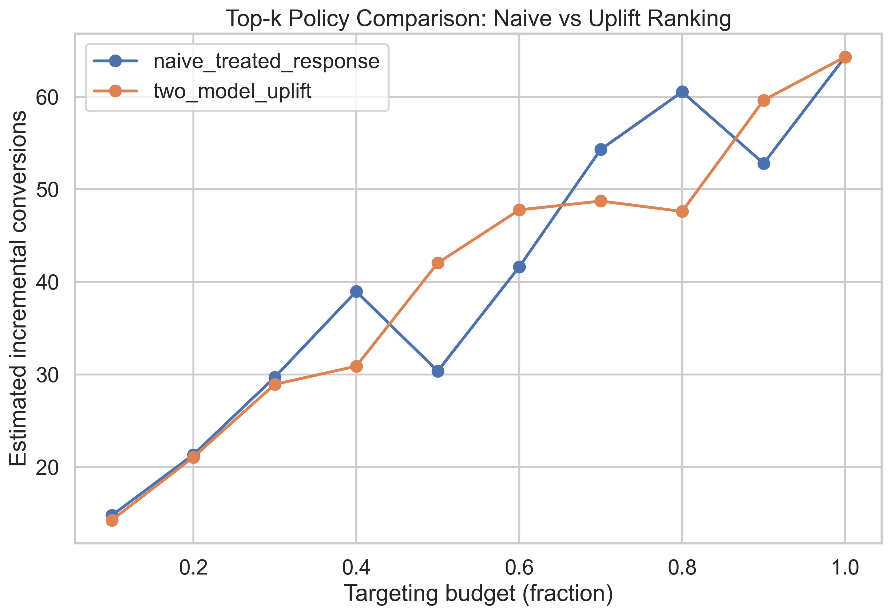
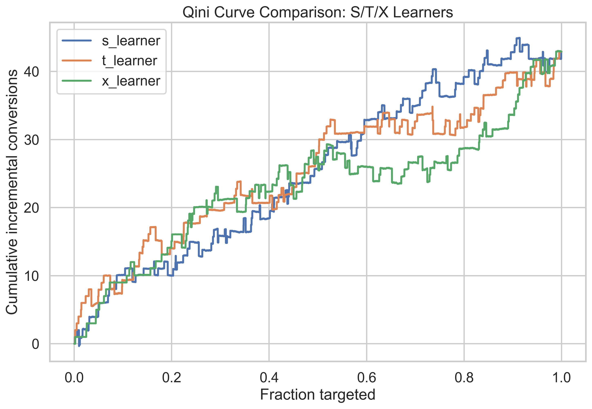
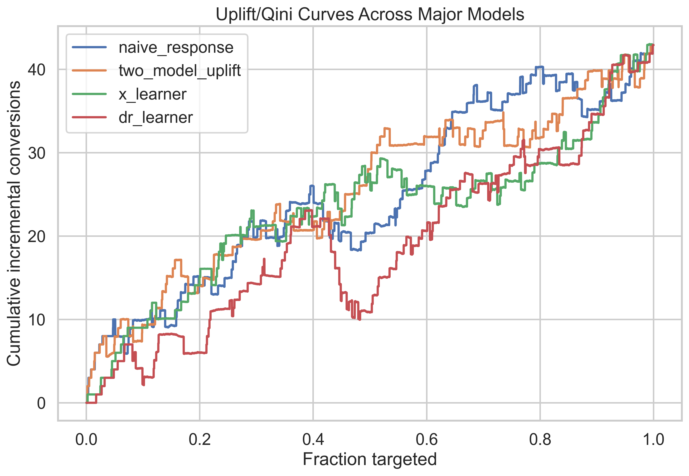
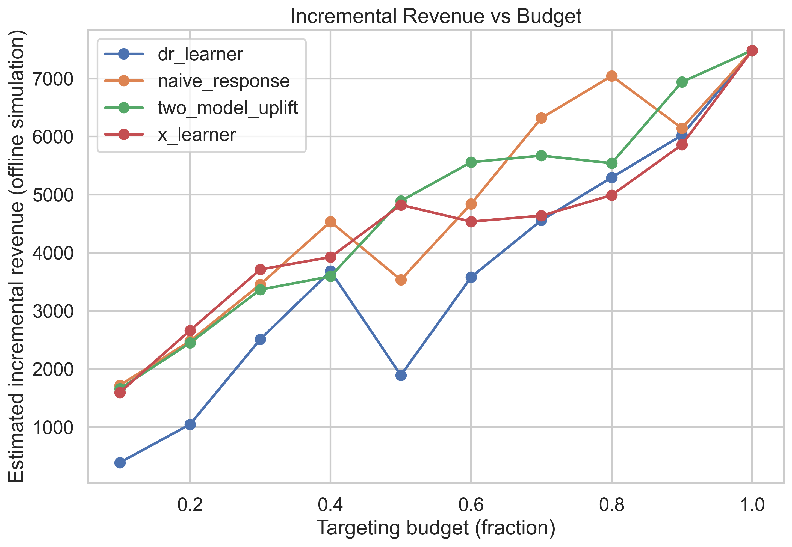

# uplift-modeling-causal-ml

[](https://www.python.org/)
[](#)
[](#)
[](#)

Causal ML and uplift modeling project for marketing campaign targeting under budget constraints.

Most campaign models answer:

> Who is likely to convert?

This project answers the decision question:

> Who is likely to convert because of the campaign?

The pipeline ranks customers by predicted incremental effect and evaluates targeting policies by incremental conversions and simulated incremental revenue.

## Project overview
This repo uses the Hillstrom Email Marketing dataset to build a full uplift workflow:

1. EDA and causal framing
2. Naive response baseline vs uplift baseline
3. S, T, X meta-learners
4. DR-style modern causal estimator
5. Policy simulation under budget constraints
6. Optional TARNet extension

Core business question:

> Which customers should receive an email campaign to maximize incremental conversions and incremental revenue, not just conversion propensity?

## Why this matters
Response modeling can over-target customers who would convert anyway.
Uplift modeling focuses on persuadable users and supports better budget allocation.

### Marketing intuition

| Customer type | Meaning | Target? |
| --- | --- | --- |
| Persuadables | More likely to convert because of email | Yes |
| Sure Things | Convert with or without email | Usually no |
| Lost Causes | Unlikely to convert either way | No |
| Sleeping Dogs | May convert less if contacted | Avoid |

## Business framing
This is a budgeted policy problem, not just a prediction problem.

- budget is finite
- customer attention is finite
- over-targeting can create fatigue
- objective is incremental value

Primary optimization target in this repo:

- primary outcome: `conversion`
- secondary outcomes: `visit`, `spend`

## Dataset
Primary dataset: Kevin Hillstrom MineThatData Email Marketing dataset.
Canonical path: `data/hillstrom.csv`.

Original setup is usually 3-arm:

- `No E-Mail`
- `Mens E-Mail`
- `Womens E-Mail`

Modeling simplification used in this repo:

- treated = any email (`Mens E-Mail` or `Womens E-Mail`)
- control = no email (`No E-Mail`)

This binary simplification is intentional and explicit.

## Causal framing
Potential outcomes perspective:

- `Y(1)`: outcome if treated
- `Y(0)`: outcome if untreated
- treatment effect: `tau(x) = E[Y(1) - Y(0) | X=x]`

For each person, only one potential outcome is observed.
That is why uplift modeling is harder than response prediction and more relevant for targeting decisions.

## Feature governance
To keep the setup causally sensible:

- all model features are pre-treatment covariates only
- outcomes and treatment-derived labels are excluded from features
- shared preprocessing and split logic are reused across notebooks

## Methods
### Classical uplift foundation

| Method | Purpose |
| --- | --- |
| Naive treated-response model | Shows why propensity ranking is not enough |
| Two-model uplift baseline | Strong practical uplift baseline |
| S-Learner | Single model with treatment as a feature |
| T-Learner | Separate treatment/control outcome models |
| X-Learner | Second-stage effect modeling for CATE |

### Modern causal and policy layer

| Method / component | Purpose |
| --- | --- |
| DR-style learner | Doubly robust style CATE estimation |
| Optional orthogonal forest | Additional modern causal validation |
| Policy simulation | Converts scores into business actions |
| Budget sensitivity analysis | Measures value across targeting budgets |

### Optional deep extension

| Method | Purpose |
| --- | --- |
| TARNet | Representation-learning uplift extension |

## Evaluation framework
Core ranking metrics:

- uplift curve
- Qini coefficient
- AUUC
- cumulative gain
- uplift by decile

Policy metrics:

- policy value at budget
- incremental conversions at budget
- incremental revenue at budget
- budget sensitivity curves

Important caveat:

Qini and AUUC are ranking metrics. They do not prove perfectly estimated individual treatment effects.

## Workflow diagram


## Current results snapshot
These results come from the current offline run using shared split logic and seed 42.

### Model ranking metrics

| Model | Qini | AUUC |
| --- | ---: | ---: |
| two_model_uplift | 3.926 | 25.378 |
| naive_response | 3.415 | 24.867 |
| x_learner | 1.584 | 23.036 |
| dr_learner (manual fallback) | -1.996 | 19.456 |

### Policy summary (from Notebook 05)

| Model | Best budget range | Incremental conversions @ top 20% | Incremental revenue @ top 20% | Recommendation |
| --- | ---: | ---: | ---: | --- |
| two_model_uplift | 0.9 | 21.06 | 2451.13 | Primary deploy candidate |
| t_learner | 0.9 | 21.06 | 2451.13 | Primary deploy candidate |
| naive_response | 0.8 | 21.33 | 2482.56 | Baseline only, not causal-targeting aligned |
| dr_manual_fallback | 0.9 | 9.02 | 1049.32 | Challenger, needs nuisance tuning |

### Takeaways
- Uplift-aware models improved targeting quality vs naive propensity ranking.
- Classical uplift learners were highly competitive on this tabular dataset.
- The current DR-style fallback did not win on this split, which supports an honest and realistic model-selection story.
- Deployment choice should balance business value, model stability, and operating complexity.

## Visual results
The figures below are generated by notebook runs into `outputs/figures`.

### Baselines and uplift curves



### Meta-learner comparison


### Policy and business impact



## Notebook roadmap
1. `notebooks/01_eda_problem_framing.ipynb`
2. `notebooks/02_naive_and_two_model_baselines.ipynb`
3. `notebooks/03_meta_learners_s_t_x.ipynb`
4. `notebooks/04_modern_causal_ml_dr_learner.ipynb`
5. `notebooks/05_policy_evaluation_and_business_impact.ipynb`
6. `notebooks/06_optional_tarnet_deep_uplift.ipynb`

Notebook 06 is optional and positioned as a research extension.

## Repository structure
```text
uplift-modeling-causal-ml/
├── data/
│   └── hillstrom.csv
├── notebooks/
├── src/
├── outputs/
│   ├── figures/
│   ├── tables/
│   ├── models/
│   └── .gitkeep
├── requirements.txt
├── README.md
└── .gitignore
```

## How to run
1. Create Python 3.10+ environment.
2. Install dependencies:
   - `pip install -r requirements.txt`
3. Launch Jupyter:
   - `jupyter lab`
4. Run notebooks in order from 01 to 05 for the core workflow.

Execution defaults:

- seed = `42`
- tabular baseline preference = `XGBoost` CPU with `tree_method="hist"`
- optional deep notebook uses Torch MPS on Apple Silicon when available, else CPU

## Offline policy assumptions
- rankings are based on predicted uplift scores
- incremental conversions are estimated from observed treatment/control outcomes in ranked buckets
- incremental revenue uses average order value or spend-based assumptions
- results are offline policy estimates, not proof of production causal lift

## Future work
- stronger DR nuisance tuning and calibration
- double machine learning extensions
- orthogonal and causal forests
- policy learning and constrained optimization
- multi-treatment uplift without binary collapse
- continuous dosage optimization
- fairness and responsible targeting
- temporal uplift and drift-aware retraining
